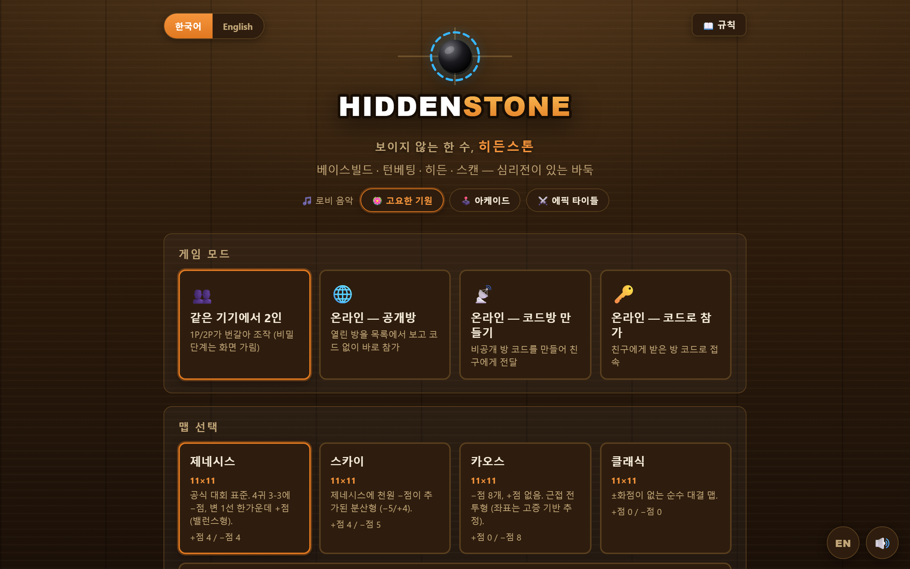
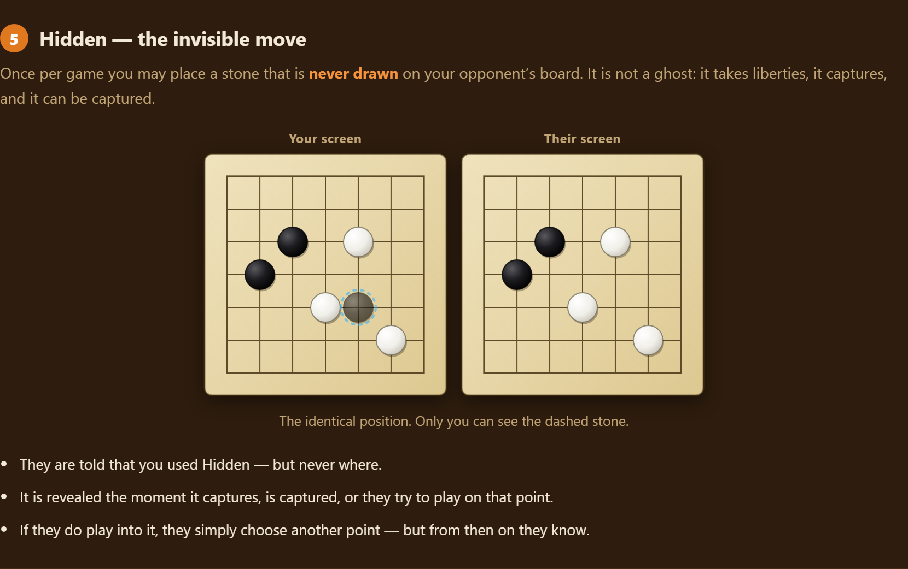

# 히든스톤 (HIDDENSTONE)

바둑 룰 위에 **±화점 · 베이스빌드 · 턴베팅 · 히든 · 스캔**을 얹은 전략 대전 게임입니다.
한국어 / English 두 언어를 앱 안에서 바로 전환할 수 있습니다.

### ▶ 바로 플레이 — <https://effortball-cloud.github.io/hiddenstone/>

설치 없이 브라우저에서 바로 돌아갑니다. 친구에게는 이 주소만 보내면 됩니다.
모바일에서는 브라우저 메뉴의 "홈 화면에 추가"로 앱처럼 설치할 수 있습니다(PWA).



## 실행 방법

### 가장 간단한 방법 (혼자 / 같은 기기 2인)
`index.html`을 브라우저(크롬/엣지)에서 열면 바로 실행됩니다.
- **같은 기기에서 2인** 모드: 1P/2P가 번갈아 조작합니다. 베이스빌드·턴베팅 같은
  비밀 단계는 핸드오프 화면("상대는 화면을 보지 마세요")으로 가려집니다.

### 언어 전환
- 로비 좌측 상단의 **한국어 / English** 스위치
- 또는 화면 어디서든 우하단의 **🌐 버튼**(대국 중에도 즉시 전환됩니다)
- 선택한 언어는 브라우저에 저장되고, 첫 방문 시엔 브라우저 언어를 따라 자동 선택됩니다.

### 혼자서도 바로 — AI 대전 (로비 기본 모드)
상대가 없어도 됩니다. 로비를 열면 **「🤖 AI와 대전」**이 기본으로 선택돼 있어
「게임 시작」만 누르면 바로 한 판이 됩니다. 난이도는 **입문 / 보통 / 고수** 3단계.
- AI는 베이스 배치·턴베팅·히든 타이밍·스캔 대상·패스까지 스스로 판단합니다.
- **AI는 상대 히든 위치를 모릅니다.** 사람과 똑같이 가려진 판만 보고 판단하며,
  히든 자리는 찍어보다가(probe) 발견합니다. 자동 테스트로 검증했습니다.

### 내 전적과 기보 다시보기
대국이 끝나면 로비 「내 전적」에 승패·승률과 최근 대국이 쌓입니다.
목록을 누르면 **그 판을 처음부터 다시 볼 수 있습니다** — 한 수씩 넘기기, 자동재생,
슬라이더로 아무 수순이나 이동, 좌우 화살표 키도 됩니다.
다시보기에서는 **히든 돌도 전부 공개**되니 "그때 여기 숨어 있었구나"를 확인할 수 있습니다.

전적·기보는 **이 브라우저에만** 저장됩니다(서버 없음, 계정 없음). 기기를 바꾸면
보이지 않고, 브라우저 기록을 지우면 함께 사라집니다. 한 판이 약 5~11KB이고
최근 20판까지 보관합니다.

### 친구와 두기 — 링크 하나면 끝
「온라인 — 코드방 만들기」로 방을 열면 **초대 링크**가 같이 나옵니다.
그 링크를 카카오톡·디스코드에 붙여넣으면, 친구는 **누르는 즉시 방에 들어옵니다**
(코드 입력 없음). 링크는 `.../hiddenstone/?room=A3K7Q` 형태이고,
접속하면 주소창은 정리되어 새로고침해도 죽은 방으로 다시 붙지 않습니다.

### 처음이면 「직접 해보기」 → 「게임 배우기」
로비 아래쪽 **「▶ 직접 해보기 (2분)」**를 누르면 9줄 연습판에서 6단계를 손으로 해봅니다
— 돌 놓기 / 따냄 / ±화점 / 베이스 돌 / 히든 / 스캔. 정답 자리를 짚어야 다음으로 넘어가고,
잘못 짚으면 안내가 뜹니다. 끝나면 그대로 AI 대국으로 이어집니다.

### 규칙을 그림으로 — 「게임 배우기」
로비 우측 상단(또는 게임 시작 버튼 아래) **「❓ 게임 배우기」**를 누르면 그림으로 된 가이드가
열립니다. ±화점 · 베이스빌드 · 턴베팅 · 히든 · 스캔 · 점수 계산을 각각 **미니 바둑판 그림**으로
설명하고, 점수 계산은 실제로 세어 맞춰볼 수 있는 예시 판을 함께 보여줍니다.
대국 중에 누르는 「규칙」 버튼은 같은 창의 **규칙 요약** 탭(빠른 참조)으로 바로 열립니다.



### 좌표 표기 (국제 바둑 표준)
해외 바둑 유저에게 익숙하도록 **OGS(online-go.com)와 같은 표기**를 씁니다.
- 열 문자는 **I를 건너뜁니다** (`A B C D E F G H J K L`) — 숫자 1과 혼동되기 때문입니다.
- 행 번호는 **아래가 1**입니다 (11줄 판이면 위가 11).

> 참고: 원작 공식 가이드의 좌표 표기(I 포함, 위가 1)와는 이름이 다릅니다.
> `js/maps.js`의 주석은 출처 표기를 그대로 남겨두었고, 게임 로직은 0-based 배열이라 영향이 없습니다.

### 온라인 멀티플레이 (친구와 대전)
인터넷 연결만 있으면 서버 설치 없이 됩니다. 두 가지 방식이 있습니다.

**① 공개방 — 코드 없이 목록 보고 참가 (추천)**
1. 「온라인 — 공개방」 선택 → 로비에 연결되면 열린 방 목록이 실시간으로 보입니다.
2. 한 명이 「＋ 공개방 만들기」 → 방이 목록에 올라가고 상대를 기다립니다.
3. 다른 사람은 목록에서 그 방의 **「참가」 버튼만 누르면** 코드 없이 바로 연결됩니다.

> 공개방 목록은 무료 공용 MQTT 브로커를 "공유 등록소"로 사용합니다(계정·서버 불필요).
> 공용 채널이라 가끔 불안정할 수 있고, 이론상 방 목록이 외부에 노출될 수 있습니다.
> 안정적인 비공개 대전이 필요하면 아래 코드방을 쓰세요.

**② 코드방 — 특정 상대와 비공개로**
1. 한 명이 「온라인 — 코드방 만들기」 → **방 코드 5자리**를 친구에게 전달(카톡 등).
2. 친구는 「온라인 — 코드로 참가」 → 코드 입력 → 연결.

두 방식 모두 실제 대국 수(手)는 PeerJS(WebRTC) P2P로 주고받습니다.
공개방의 MQTT는 "방 발견"에만 쓰이고, 연결되면 곧바로 P2P로 넘어갑니다.

> ⚠ `index.html`을 파일로 직접 열어도 동작하지만, 낯선 사람끼리 공개방으로 만나려면
> 아래 "인터넷에 올리기"로 URL을 하나 만들어 공유하는 게 좋습니다.

### 인터넷에 올리기 (링크 하나로 공유)
정적 파일뿐이므로 무료 호스팅에 그대로 올리면 됩니다. **별도 백엔드 설정(Firebase 등)이
전혀 필요 없습니다** — 공개방 목록도 클라이언트에서 공용 MQTT 브로커로 처리하니까요.
- **GitHub Pages**: 저장소에 푸시 → Settings→Pages 활성화 (https라서 공개방도 정상 동작)
- **Netlify Drop**(drop.netlify.com): 이 폴더를 드래그&드롭하면 즉시 URL 발급
- 올린 뒤 친구에게 URL만 보내면, 둘 다 접속해 **공개방 목록에서 서로를 보고** 대전할 수 있습니다.

## 게임 규칙 요약

| 요소 | 내용 |
|---|---|
| 필드 | 11×11(제네시스·스카이·카오스·클래식) / 13×13(세렝게티), 사전 선택 |
| ±화점 | +에 돌을 두면 +5점, −는 −5점. **처음 놓을 때 1회만** 적용되고 화점은 사라짐. 남은 −점은 집으로 계산 안 됨 |
| 베이스빌드 | 시작 전 각자 몰래 3개 배치 후 동시 공개. 겹치면 둘 다 제거 + 그 자리 −점. 베이스 돌은 5점짜리 |
| 턴베팅 | 덤을 비밀 베팅(0~25). 높은 쪽이 흑+선공, 베팅값을 후공에게 지급. 동률 2회면 랜덤 선공(흑백 유지) |
| 히든(H) | 게임당 1회, 보이지 않는 착수. 잡히거나 잡으면 공개. 상대가 그 자리를 클릭하면 공개되고 상대는 다른 곳에 착수 |
| 스캔(S) | 게임당 1회, 한 지점 확인. 성패 무관 상대 +2점. 찾아도 잠깐만 보임(기억!). 턴 소비 없음 |
| 착수 | 돌 1개 = 1점. 자살수 금지, 패 규칙 적용 |
| 따냄 | 잡힌 돌은 **잡힌 쪽의 점수가 사라지는** 것으로 반영 (일반 돌 −1, 베이스 −5) |
| 초읽기 | (옵션) 매 수 25초×3회 또는 15초×3회. 1회 소진마다 −2점, 전부 소진하면 시간패 |
| 종국 | 양측 연속 패스 → 사석 지정 → 계가. **동점이면 후공 승** |
| 점수 | 돌 + 베이스×5 + 집 + (+점×5) − (−점×5) + 턴베팅 + 스캔보너스 − 초읽기벌점 |

## 파일 구성

```
히든스톤/
├─ index.html      # 진입점 (이 파일을 열면 됨)
├─ css/style.css   # 스타일
├─ js/
│  ├─ i18n.js      # 한국어/영어 사전 + 언어 전환 엔진
│  ├─ guide.js     # 「게임 배우기」 일러스트 가이드 (SVG 미니 보드 그림 생성)
│  ├─ tutorial.js  # 「직접 해보기」 인터랙티브 튜토리얼 (6단계 연습판)
│  ├─ ai.js        # AI 상대 (휴리스틱 + 2수 미니맥스, 난이도 3단계)
│  ├─ records.js   # 전적·기보 저장 (localStorage, 서버 없음)
│  ├─ replay.js    # 기보 재생 (수순대로 다시 두어 각 시점의 판을 복원)
│  ├─ maps.js      # 맵 정의 (제네시스/스카이/카오스/클래식/세렝게티)
│  ├─ engine.js    # 룰 엔진 (바둑 룰 + 특수 룰, DOM 비의존)
│  ├─ ui.js        # 캔버스 보드 렌더러
│  ├─ net.js       # 온라인 멀티플레이 (PeerJS/WebRTC) + 공개방 로비(MQTT)
│  ├─ audio.js     # 사운드/BGM 합성 + 음성 안내
│  └─ main.js      # 게임 흐름 상태 머신
└─ README.md
```

### 새 문구를 추가할 때
사용자에게 보이는 문자열은 코드에 직접 쓰지 말고 `js/i18n.js`의 `DICT.ko` / `DICT.en`에
같은 키로 넣습니다.
- 정적 HTML: `<span data-i18n="키">` (HTML 태그가 들어가면 `data-i18n-html`,
  placeholder는 `data-i18n-ph`, 툴팁은 `data-i18n-title`)
- 코드 안: `t('키', { 파라미터: 값 })` — 사전 값의 `{파라미터}` 자리에 치환됩니다.
- 언어를 바꾸면 정적 DOM은 `HSI18n.apply()`가, 동적 문구는 `main.js`의 `relabelUI()`가
  다시 만듭니다. 언어 전환 후에도 남아야 하는 문구라면 `relabelUI()`에 추가하세요.
- 가이드 문구·그림은 `js/guide.js`에 있습니다. 그림은 `board()` 헬퍼로 SVG를 만들며
  게임 내 렌더러와 같은 시각 언어(베이스=소용돌이, 히든=청록 점선, ±화점=다이아몬드)를 씁니다.
  **점수 계산 예시는 그림에서 직접 세어 맞아야 하니**, 판을 바꾸면 표의 숫자도 함께 고치세요.

## 알아둘 점
- 온라인 모드의 히든 위치는 상대 "화면"에는 절대 표시되지 않지만, 기술적으로는
  양쪽 브라우저가 같은 게임 상태를 공유합니다(개발자 도구로 파고들면 볼 수 있음).
  친선전 용도로는 충분하지만, 진지한 랭킹전을 만들려면 서버 권위 방식으로
  업그레이드가 필요합니다.
- 온라인 모드는 PeerJS 공용 시그널링 서버(무료)를 사용합니다. 회사 방화벽 등
  일부 네트워크에서는 연결이 안 될 수 있습니다.
- 맵 중 **카오스·클래식의 ±화점 좌표는 추정 배치**입니다(원 출처에 좌표 기록이 없음).
  제네시스·스카이·세렝게티는 공식 가이드 좌표 그대로입니다.
- 콘솔 디버그 핸들: `window.__hsApp` (앱 상태), `window.HSI18n` (언어),
  `window.HSAI` (AI), `window.HSTutorial` (튜토리얼).

### AI를 손볼 때 지켜야 할 것
`js/ai.js`의 모든 판단은 **`sanitizedView()`가 만든 가려진 판**에서만 해야 합니다.
`game.isHidden`이나 `game.board`를 직접 읽으면 AI가 상대의 보이지 않는 돌을 알게 되어
게임이 망가집니다. 실제로 개발 중 `lastMove`가 상대 히든을 가리켜 "직전 수 근처에 응수"
보너스가 그쪽으로 끌려가는 누출이 있었고, 자동 테스트로 잡았습니다.
새 정보를 참조할 때는 **사람이 화면에서 볼 수 있는 것인지** 먼저 확인하세요.
